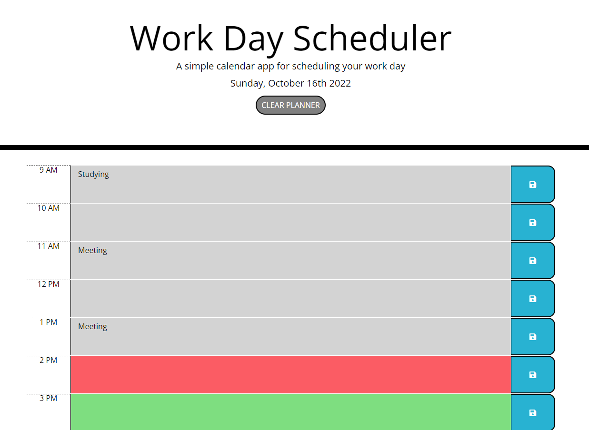

# Work Day Scheduler

## Module 5 Challenge for MSU's Coding Bootcamp

A work scheduler

## Objectives
* Create an interactive planner
* Events are saved even after a refresh
* Make timeblocks responsive
* Saves to local storage

## Completed Page

https://griffinnb.github.io/scheduler/

Was created using previous activities and challenges in the bootcamp, along with tutorials and walkthroughs on google. Thank you to FreeCodeCamp for the helpful guides.
